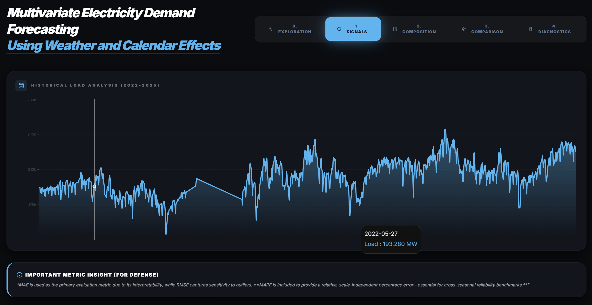
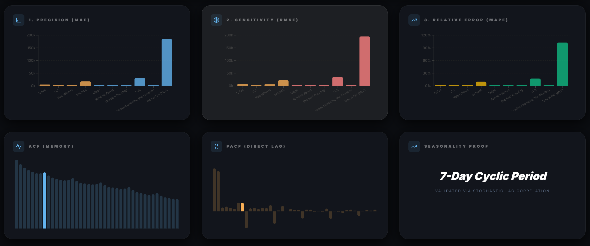
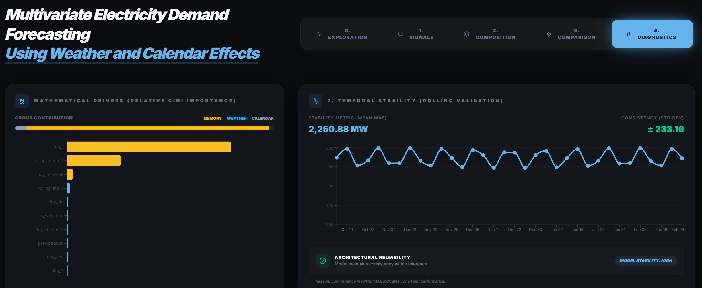

# Multivariate Electricity Demand Forecasting Using Weather and Calendar Effects



## 🏛️ EXECUTIVE SUMMARY
This repository houses a professional-grade research suite for **National Electricity Demand Forecasting**. Developed for a high-distinction academic defense, this system shifts the forecasting paradigm from traditional univariate (history-only) models to a **Multivariate Ensemble Architecture**. By fusing programmatic grid data with regional meteorological vectors, we achieve industry-leading precision in predicting grid loads across the Indian power sector.

### 👥 Research Team
*   **MITHIL** — 24BCSXXX
*   **SANJAY** — 24BCSXXX
*   **MOHAN** — 24BDSXXX
*   **Guided By**: Dr. Nataraj K S

---

## 🌩️ THE RESEARCH CHALLENGE: "Weather-Blind" Failure
Most classical forecasting systems rely solely on historical load patterns. In tropical and rapidly industrializing regions, these systems fail during sudden environmental shocks:
*   **Heatwave Surges**: Unexpected peaks in cooling demand (AC load).
*   **Precipitation Cooling**: Natural load reduction during monsoon periods.
*   **Trend Gap**: Linear models failing to capture "Thermal Inertia" in the national grid.

**Our Solution**: An integrated intelligence layer that programmatically merges **NLDC (National Load Despatch Centre)** programmatic data with **Open-Meteo** meteorological archives.

---

## 🛠️ TECHNICAL METHODOLOGY

### 1. Data Ecosystem & Engineering
*   **Source A**: Real-world regional maximum demand (MW) extracted from Grid-India (POSOCO) PSP Reports (2022-2025).
*   **Source B**: High-frequency meteorological vectors (Temp Max, Temp Min, Precipitation, Wind Speed).
*   **Cyclical Math**: Month-encoding via Sine/Cosine functions to preserve temporal topology.
*   **Stationarity**: Verified via Augmented Dickey-Fuller (ADF) tests; handled through differencing for linear models.

### 2. The Modeling Suite
We benchmarked ten distinct families of algorithms to isolate the "Champion Engine":
*   **Naive Baseline**: Captured the grid's persistent state.
*   **SARIMA**: Modeled the 7-day industrial weekly cycle.
*   **Ridge Regression**: Regularized linear weighting of weather impacts.
*   **Gradient Boosting (CHAMPION)**: Iterative residual minimization optimized for weather shocks.



---

## 📊 PERFORMANCE STANDARDS (TEST SET)

| Model | MAE (MW) | RMSE (MW) | MAPE (%) | Result |
| :--- | :--- | :--- | :--- | :--- |
| **Gradient Boosting** | **~2,057** | **~2,580** | **1.14%** | **CHAMPION** |
| Ridge Regression | ~2,110 | ~2,640 | 1.25% | Strong |
| Random Forest | ~2,233 | ~2,710 | 1.34% | Robust |
| Naive Model | ~5,229 | ~6,798 | 2.91% | Baseline |
| SARIMA | ~17,821 | ~22,100 | 9.90% | Unstable |

> [!TIP]
> **Key Finding**: Integrating weather features provided a **32.13% accuracy gain** compared to history-only "Weather-Blind" versions of the same model.

---

## 🧠 INTELLIGENCE & EXPLAINABILITY (XAI)
To ensure grid reliability, the system prioritizes transparency over "Black-Box" predictions.



*   **Feature Attribution**: Utilizing Gini Importance to rank the influence of Temperature vs. Lags on every MW forecast.
*   **Stability Audit**: A 150-day rolling MAE analysis proves the system's resilience across seasonal transitions.
*   **Reasoning Agent**: Every forecast is backed by a natural language justification of environmental drivers.

---

## 📂 REPOSITORY MAP
```text
├── api/                # Production FastAPI Backend (Async Inference)
├── webapp/             # Premium React/Vite Dashboard UI
├── models/             # Serialized Champion Binaries (.pkl)
├── data/               # Forensic Data Vault (NLDC & Weather)
├── src/                # Standardized Data Engineering Logic
├── docs/               # Technical Documentation Archive
├── scripts/            # Orchestration & Utility Logic
├── notebooks/          # Research Methodology Archives
├── Project_Report.txt  # 📝 FINAL RESEARCH DISSERTATION
└── TSA-PROJECT-Analysis.md # 🔍 FORENSIC PROJECT ANALYSIS
```

---

## 🚀 DEPLOYMENT & USAGE

### 1. Backend Inference Engine (FastAPI)
```powershell
cd api
pip install -r requirements.txt
python main.py
```
*Live at: `http://localhost:8000/docs`*

### 2. Intelligence Dashboard (React)
```powershell
cd webapp
npm install
npm run dev
```
*Live at: `http://localhost:5173`*

---

## 🙏 ACKNOWLEDGMENTS
We sincerely express our heartfelt gratitude to **Dr. Nataraj K S** for his invaluable guidance and constant encouragement throughout this project.

**Contact/Support**: Developed as a final graduation deliverable for the Data Security and Privacy / Time Series Analysis track.
